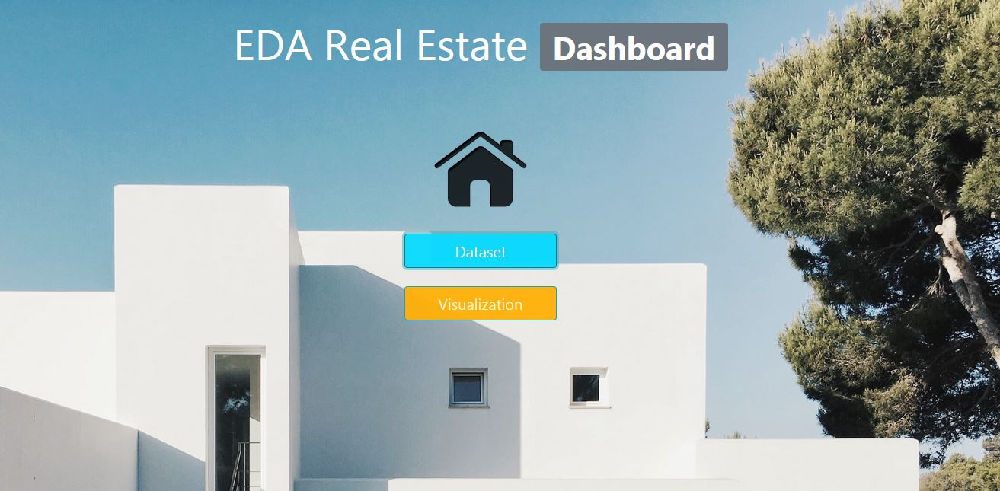
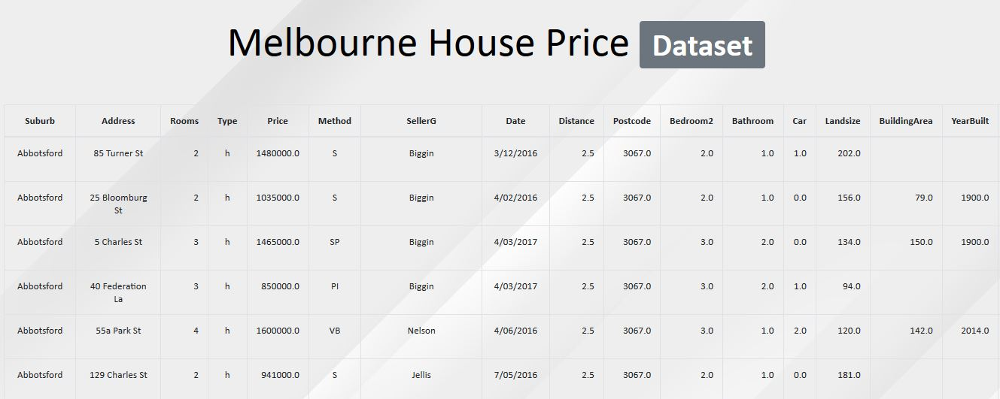
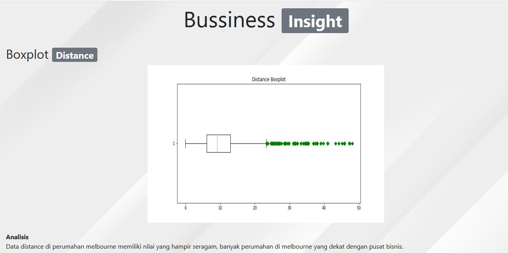
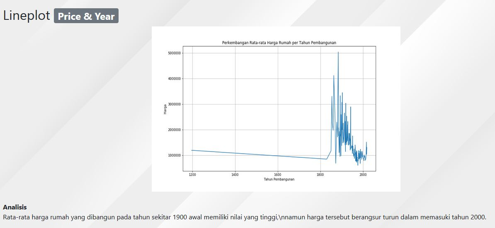

# Soal Ujian -  **Data Analytics & Visualization**


#

### **Soal 1 - ``PyMySQL`` - Sakila Database** (40 poin)

Database ```sakila``` merupakan _sample dummy database_ yang menyimpan informasi seputar toko rental DVD. Apabila belum ada database ```sakila``` di laptop Anda, ikuti panduan di laman [ini](https://dev.mysql.com/doc/sakila/en/sakila-installation.html).

*__Soal :__* Buatlah file _jupyter_ (_.ipynb_) dan buat _connection_ Python dengan server MySQL Anda, lalu gunakan database _sakila_. ``Tuliskan langkah-langkah/query MySQL dan tampilkan hasilnya berupa DataFrame.`` Anda __dilarang__ membuat database baru, merubah struktur table, membuat view atau segala bentuk tindakan yang mengubah struktur database.

1. Tampilkan daftar __10 film komedi dengan durasi tersingkat__. Urutkan data berdasarkan film dengan durasi terpendek. Kolom yang diwajibkan tampil adalah __title__, __category__ dan __length__. Output yang diharapkan:

    ```bash
    +------------------+----------+--------+
    | title            | category | length |
    +------------------+----------+--------+
    | DOWNHILL ENOUGH  | Comedy   |     47 |
    | HEAVEN FREEDOM   | Comedy   |     48 |
    | PARADISE SABRINA | Comedy   |     48 |
    | HURRICANE AFFAIR | Comedy   |     49 |
    | LION UNCUT       | Comedy   |     50 |
    | ZORRO ARK        | Comedy   |     50 |
    | CLOSER BANG      | Comedy   |     58 |
    | AIRPLANE SIERRA  | Comedy   |     62 |
    | LONELY ELEPHANT  | Comedy   |     67 |
    | DOOM DANCING     | Comedy   |     68 |
    +------------------+----------+--------+
    ```

2. Tampilkan daftar lengkap __kategori film beserta jumlah film tiap kategori & rata-rata harga sewa DVD film tiap kategori__. Urutkan data dari kategori dengan jumlah film terbanyak. Kolom yang diwajibkan ada minimal adalah __kategori__, __jumlah film__ dan __rata-rata harga sewa__. Output yang diharapkan:

    ```bash
    +-------------+-------------+---------------+
    | kategori    | jumlahMovie | rataHargaSewa |
    +-------------+-------------+---------------+
    | Foreign     |          73 |      3.099589 |
    | Sports      |          73 |      3.099589 |
    | Family      |          69 |      2.758116 |
    | Documentary |          68 |      2.666471 |
    | Animation   |          66 |      2.808182 |
    | Action      |          64 |      2.646250 |
    | New         |          63 |      3.116984 |
    | Drama       |          61 |      2.990000 |
    | Games       |          61 |      3.252295 |
    | Sci-Fi      |          61 |      3.219508 |
    | Children    |          60 |      2.890000 |
    | Comedy      |          58 |      3.162414 |
    | Classics    |          57 |      2.744386 |
    | Horror      |          56 |      3.025714 |
    | Travel      |          56 |      3.275714 |
    | Music       |          51 |      2.950784 |
    +-------------+-------------+---------------+
    ```

3. Tampilkan daftar __10 aktor/aktris yang paling banyak membintangi film__. Kolom yang ditampilkan minimal: __id aktor__, __nama depan__, __nama belakang__ dan __jumlah film yang dibintangi__ kemudian urutkan dari aktor/aktris yang membintangi film terbanyak. Output yang diharapkan:

    ```bash
    +----------+------------+-------------+--------------+
    | actor_id | first_name | last_name   | jumlah_Movie |
    +----------+------------+-------------+--------------+
    |      107 | GINA       | DEGENERES   |           42 |
    |      102 | WALTER     | TORN        |           41 |
    |      198 | MARY       | KEITEL      |           40 |
    |      181 | MATTHEW    | CARREY      |           39 |
    |       23 | SANDRA     | KILMER      |           37 |
    |       81 | SCARLETT   | DAMON       |           36 |
    |      158 | VIVIEN     | BASINGER    |           35 |
    |      144 | ANGELA     | WITHERSPOON |           35 |
    |      106 | GROUCHO    | DUNST       |           35 |
    |       60 | HENRY      | BERRY       |           35 |
    +----------+------------+-------------+--------------+
    ```

4. Dari soal sebelumnya diketahui ```Gina Degeneres``` merupakan aktris yang paling banyak membintangi film, dengan total **42** judul film. Kategori film apakah yang paling banyak dibintanginya? Untuk mengetahuinya, tampilkan daftar __kategori film beserta jumlah film yang pernah dibintangi oleh ```Gina Degeneres```__. Kolom yang diwajibkan ada yaitu __kategori film__ dan __jumlah film yang dibintangi__. Output yang diharapkan:

    ```bash
    +-------------+--------------+
    | category    | jumlah_Movie |
    +-------------+--------------+
    | Documentary |            3 |
    | Foreign     |            2 |
    | Music       |            4 |
    | New         |            1 |
    | Sci-Fi      |            7 |
    | Action      |            3 |
    | Drama       |            2 |
    | Animation   |            4 |
    | Horror      |            1 |
    | Family      |            4 |
    | Comedy      |            3 |
    | Children    |            2 |
    | Classics    |            2 |
    | Sports      |            2 |
    | Games       |            1 |
    | Travel      |            1 |
    +-------------+--------------+
    ```

5. Dari soal sebelumnya diketahui ```Gina Degeneres``` paling banyak membintangi film bergenre science-fiction, dengan total **7** judul film. Tampilkan daftar __judul film sci-fi yang pernah dibintangi oleh ```Gina Degeneres```__. Kolom yang diwajibkan ada yaitu __judul film__ dan __kategorinya__. Output yang diharapkan:

    ```bash
    +---------------------+----------+
    | title               | category |
    +---------------------+----------+
    | CHARIOTS CONSPIRACY | Sci-Fi   |
    | COLDBLOODED DARLING | Sci-Fi   |
    | FRISCO FORREST      | Sci-Fi   |
    | GOODFELLAS SALUTE   | Sci-Fi   |
    | LICENSE WEEKEND     | Sci-Fi   |
    | OPEN AFRICAN        | Sci-Fi   |
    | SPIRITED CASUALTIES | Sci-Fi   |
    +---------------------+----------+
    ```

#

### **Soal 2 -  EDA (``Exploratory Data Analysis``) Real Estate**  (40 poin)

Anda adalah seorang Data Scientist di sebuah perusahaan real estate di Melbourne. Anda diberikan dataset tentang harga rumah berbagai tipe di Melbourne beserta variabel-variabel terkait rumah seperti jumlah kamar, luas tanah, metode penjualan, dan lainnya.

Data ini adalah cuplikan data yang dibuat oleh Tony Pino. Data harga rumah ini merupakan hasil web scrapping dari data yang terpublikasikan untuk publik melalui [Domain.com.au](https://www.domain.com.au/).

Informasi mengenai keterangan variabel (_features_) dan apabila Anda kesulitan download dataset pada repo ini, Anda bisa akses [Kaggle](https://www.kaggle.com/dansbecker/melbourne-housing-snapshot)

__Soal__: Buatlah sebuah file _notebook_ (__EDA_HouseMarket.ipynb__) dan ikuti panduan _Exploratory Data Analysis_ berikut:

1. Untuk _feature/column_ ```Landsize``` & ```Price```, hitung dan beri penjelasan (_insight_) terkait:
    - Titik Pusat Data (_Central Tendency_)
    - Persebaran Data (_Dispersion_)
    - Distribusi Data (_Distribution_)

2. Carilah data _outlier_ dan beri penjelasan (_insight_) pada _feature/column_ ```Distance``` ! Tambahkan plot untuk menampilkan adanya data _outlier_!

3.  Tampilkan distribusi (sebaran data) dalam bentuk plot yang tepat, untuk _feature/column_ ```YearBuilt```. Jelaskan _insight_ apa yang Anda dapatkan di setiap _plot_ tersebut!

4. Tampilkan perkembangan rata-rata harga (_price_) rumah berdasarkan tahun pembangunan rumah (_Year_) menggunakan plot yang tepat! Jelaskan (_insight_) perkembangan rata-rata harga rumah dari plot yang Anda buat!

5. Di antara ```Landsize```, ```Distance```, & ```Rooms```, manakah _feature/column_ yang memiliki nilai korelasi tertinggi pada _feature/column_ ```Price```? Jelaskan metode korelasi apa yang Anda gunakan, serta apa _insight_ untuk perusahaan setelah mengetahui nilai korelasi tersebut?

6. Temukan ``RegionName`` yang rata-rata harga (_Price_) propertinya paling tinggi, serta tampilkan RegionName dan rata-rata harga rumah dalam bentuk Barplot! Lalu, di region yang memiliki rata-rata harga properti tertinggi, carilah:
    - Lima __``CouncilArea``__ yang memiliki rata-rata harga rumah tertinggi!
    - Tipe properti (__``Type``__) yang memiliki rata-rata harga rumah tertinggi!
    - Metode penjualan properti (__``Method``__) yang paling sering dilakukan!

7. Lakukan Uji Hipotesis untuk menguji apakah ada perbedaan harga properti antar Region Name!

✅ Di setiap visualisasi, penjelasan (_insight_) yang Anda sampaikan sebaiknya yang berhubungan dengan keuntungan/kerugian perusahaan _real estate_ atau manfaat ke konsumen.

#

### **Soal 3 - Dashboard for EDA Real Estate**  (20 poin)
Buatlah dashboard menggunakan Flask yang berisi visualisasi yang Anda buat di soal nomor 2! Beri penjelasan sekilas di setiap plot yang Anda tampilkan!

Kurang lebih tampilan Dashboard seperti berikut:

**Contoh Tampilan Home**


**Contoh Tampilan Dataset**


**Contoh Tampilan Visualization**


Tampilkan seluruh visualisasi yang Anda buat di soal nomor 2!

<hr>

## ``Good luck & Happy Coding``